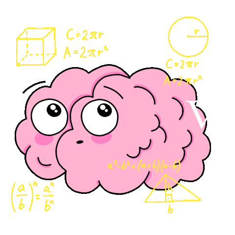

[↩️ صفحه اصلی](/README.md)

# 📐 ریاضی 1

## 📊 اطلاعات کلی درس

    <table border="1">
        <thead>
            <tr>
                <th>کد درس</th>
                <th>واحد</th>
                <th>نوع درس</th>
                <th>پیش‌نیاز</th>
            </tr>
        </thead>
        <tbody>
            <tr>
                <td>391403</td>
                <td>3</td>
                <th>پایه</th>
                <td>ندارد</td>
            </tr>
        </tbody>
    </table>

## 🎯 اهداف درس
درس **ریاضی 1** به مبانی اولیه ریاضیات پیشرفته می‌پردازد که پایه‌گذار بسیاری از مفاهیم مورد نیاز در علوم مهندسی و فنی است. مباحث اصلی این درس شامل توابع، حد و پیوستگی، مشتق و کاربردهای آن، انتگرال‌گیری و روش‌های محاسبه آن، کاربردهای انتگرال، دنباله‌ها و سری‌ها و معرفی سری‌های نامتناهی است. این مفاهیم به عنوان ابزارهای کلیدی برای تحلیل و حل مسائل مختلف در رشته‌های مهندسی و علوم پایه مورد استفاده قرار می‌گیرند.

## 📚 منابع درس
- Thomas' Calculus
    - [کتاب فارسی](https://engclubs.net/tag/%D8%AF%D8%A7%D9%86%D9%84%D9%88%D8%AF-pdf-%DA%A9%D8%AA%D8%A7%D8%A8-%D8%B1%DB%8C%D8%A7%D8%B6%DB%8C-%D8%AA%D9%88%D9%85%D8%A7%D8%B3) 
    - [کتاب زبان اصلی](https://rodrigopacios.github.io/mrpacios/download/Thomas_Calculus.pdf)

## 📅 سیلابس معمول

    <table border="1">
        <thead>
            <tr>
                <th>موضوع</th>
            </tr>
        </thead>
        <tbody>
            <tr>
                <td>اعداد مختلط</td>
            </tr>
            <tr>
                <td>حد</td>
            </tr>
            <tr>
                <td>قوانین محاسبه حد</td>
            </tr>
            <tr>
                <td>پیوستگی</td>
            </tr>
            <tr>
                <td>تعریف حد و مشتق</td>
            </tr>
            <tr>
                <td>قاعده زنجیری، مشتق توابع مثلثاتی، قضیه مقدار میانگین</td>
            </tr>
            <tr>
                <td>قضیه مقدار میانگین، کاربردهای مشتق و مشتق‌گیری ضمنی</td>
            </tr>
            <tr>
                <td>مشتق‌گیری ضمنی و مشتق‌های مرتبه بالاتر</td>
            </tr>
            <tr>
                <td>توابع نمایی و لگاریتمی</td>
            </tr>
            <tr>
                <td>توابع مثلثاتی وارون و توابع هایپربولیک</td>
            </tr>
            <tr>
                <td>کاربردهای مشتق، نمودار توابع</td>
            </tr>
            <tr>
                <td>تورفتگی و تحدب، تقریب خطی</td>
            </tr>
            <tr>
                <td>چندجمله‌ای‌های تیلور و قانون هوپیتال</td>
            </tr>
            <tr>
                <td>تعریف انتگرال</td>
            </tr>
            <tr>
                <td>قضیه اساسی حساب دیفرانسیل و انتگرال، تغییر متغیر</td>
            </tr>
            <tr>
                <td>انتگرال‌گیری با جز به جز، انتگرال توابع گویا</td>
            </tr>
            <tr>
                <td>انتگرال توابع گویا، انتگرال ناسره</td>
            </tr>
            <tr>
                <td>انتگرال‌گیری عددی</td>
            </tr>
            <tr>
                <td>محاسبه حجم با انتگرال</td>
            </tr>
            <tr>
                <td>دنباله‌ها و سری‌های عددی</td>
            </tr>
            <tr>
                <td>آزمون‌های همگرایی</td>
            </tr>
            <tr>
                <td>سری‌های توانی</td>
            </tr>
        </tbody>
    </table>

---
موفق باشید! 🚀
