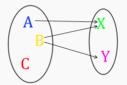

[↩️ صفحه اصلی](/README.md)

# 🖥️ ریاضیات گسسته

## 📊 اطلاعات کلی درس

    <table border="1" style="text-align: right;">
        <thead>
            <tr>
                <th>کد درس</th>
                <th>واحد</th>
                <th>نوع درس</th>
                <th>هم‌نیاز</th>
            </tr>
        </thead>
        <tbody>
            <tr>
                <td>777786</td>
                <td>3</td>
                <td>اصلی</td>
                <td><a href="/نیسمال 1/مبانی کامپیوتر و برنامه سازی/README.md">مبانی کامپیوتر و برنامه سازی</a>، ریاضی 1</td>
            </tr>
        </tbody>
    </table>

## 🎯 اهداف درس
درس ریاضیات گسسته به مفاهیمی مانند مجموعه‌ها، گراف‌ها، توابع، و الگوریتم‌ها می‌پردازد. هدف اصلی آن، ارائه ابزارهای ریاضی برای حل مسائل منطقی و ساختاری است. این درس در طراحی الگوریتم‌ها، ساختمان داده‌ها، منطق و نظریه گراف‌ها کاربرد دارد و به مدل‌سازی و حل مسائل بهینه‌سازی کمک می‌کند.

## 📚 منابع اصلی درس

#### منابع دکتر لویمی:
1. **Discrete Mathematics and Its Applications** (7th Edition)
   - نویسنده: Kenneth Rosen 
   - [لینک دانلود کتاب](منابع/rosen_discrete_mathematics_and_its_applications_7th_edition.pdf)

#### منابع دکتر فرخیان:

1. **ریاضیات گسسته** 
   - نویسنده: Grimaldi
   - [لینک دانلود](https://www.konkurcomputer.ir/computer-books/book/%DA%A9%D8%AA%D8%A7%D8%A8-%D8%B1%DB%8C%D8%A7%D8%B6%DB%8C%D8%A7%D8%AA-%DA%AF%D8%B3%D8%B3%D8%AA%D9%87-%DA%AF%D8%B1%DB%8C%D9%85%D8%A7%D9%84%D8%AF%DB%8C.html)

2. **ریاضیات گسسته** 
   - نویسنده: بهفروز
   - منبعی کامل برای درک مفاهیم گسسته به زبان فارسی
   - [لینک](https://behforooz.com/%D8%B1%DB%8C%D8%A7%D8%B6%DB%8C%D8%A7%D8%AA-%DA%AF%D8%B3%D8%B3%D8%AA%D9%87-%D9%88-%D8%A7%D9%84%DA%AF%D9%88%D8%B1%DB%8C%D8%AA%D9%85-%D9%87%D8%A7/)

## 📅 سیلابس معمول

    <table border="1" style="text-align: right;">
        <thead style="text-align: center;">
            <tr>
                <th>موضوع</th>
            </tr>
        </thead>
        <tbody>
            <tr>
                <td>دنباله‌ها، توابع، مجموعه‌ها و ماتریس‌ها</td>
            </tr>
            <tr>
                <td>نظریه اعداد و رمزنگاری</td>
            </tr>
            <tr>
                <td>استقرا و مسائل بازگشتی</td>
            </tr>
            <tr>
                <td>شمارش</td>
            </tr>
            <tr>
                <td>احتمال</td>
            </tr>
            <tr>
                <td>گراف</td>
            </tr>
        </tbody>
    </table>

## 💡 نکته مهم:

بخشی از نمره به حل تمرین و پروژه ها اختصاص دارد.

---

موفق باشید! 🚀
