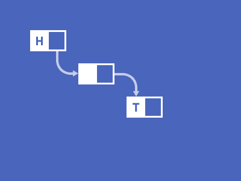

[↩️ صفحه اصلی](/README.md)
# 🖥️ ساختمان‌های داده

## 📊 اطلاعات کلی درس

  <table border="1">
    <tr>
      <th>کد درس</th>
      <th>واحد</th>
      <th>نوع درس</th>
      <th>پیش‌نیازها</th>
    </tr>
    <tr>
      <td>7777202</td>
      <td>3</td>
      <td>اصلی</td>
      <td><a href="/نیمسال 2/ریاضیات گسسته/README.md">ریاضیات گسسته</a> و <a href="/نیمسال%202/برنامه%20سازی%20پیشرفته/README.md">برنامه‌سازی پیشرفته</a></td>
    </tr>
  </table>

## 🎯 اهداف درس
این درس به دانشجویان مفاهیم پایه‌ای و پیشرفته ساختمان‌های داده را آموزش می‌دهد. درس معمولاً توسط دکتر علوی تدریس شده و اطلاعات زیر بر اساس تدریس‌های اخیر ایشان تنظیم شده است.

## 📚 منابع اصلی درس
1. **کتاب ساختمان‌های داده در C++** (نیم‌سال اول 1401)
   - نویسندگان: دکتر فاطمه سعادت جو (عضو هیئت علمی دانشگاه علم و هنر) و مهندس عرفان قندهاری (مدرس دانشگاه)
   - [لینک خرید کتاب](https://www.fadakbook.ir/product/19459/%DA%A9%D8%AA%D8%A7%D8%A8-%D8%AF%D8%B1%D8%B3%DB%8C-%D8%B3%D8%A7%D8%AE%D8%AA%D9%85%D8%A7%D9%86-%D8%AF%D8%A7%D8%AF%D9%87-%D9%87%D8%A7-%D8%AF%D8%B1-c-%D8%B4%D8%A7%D9%85%D9%84-%D9%85%D8%AB%D8%A7%D9%84-%D9%88%D8%AA%D9%85%D8%B1%DB%8C%D9%86-%D9%87%D8%A7%DB%8C-%D9%85%D8%AA%D8%B9%D8%AF%D8%AF-%D8%A7%D8%AB%D8%B1-%D8%AF%DA%A9%D8%AA%D8%B1-%D9%81%D8%A7%D8%B7%D9%85%D9%87-%D8%B3%D8%B9%D8%A7%D8%AF%D8%AA-%D8%AC%D9%88)
   - [لینک دانلود PDF کتاب](https://drive.google.com/file/d/1RFwVAGPzoTnfdzWubSnJgrQgbnQDnVue/view?usp=drive_link)

## 📅 سیلابس معمول

  <table border="1">
    <tr>
      <th>موضوع</th>
    </tr>
    <tr>
      <td>مروری بر ساختمان داده‌ها</td>
    </tr>
    <tr>
      <td>تحلیل پیچیدگی الگوریتم‌ها</td>
    </tr>
    <tr>
      <td>آرایه‌ها</td>
    </tr>
    <tr>
      <td>پشته‌ها و صف‌ها</td>
    </tr>
    <tr>
      <td>لیست‌های پیوندی</td>
    </tr>
    <tr>
      <td>درخت‌ها</td>
    </tr>
    <tr>
      <td>گراف‌ها</td>
    </tr>
    <tr>
      <td>روش‌های مرتب‌سازی</td>
    </tr>
    <tr>
      <td>روش‌های جستجو</td>
    </tr>
  </table>

## 🔗 منابع مفید دیگر
- [GeeksforGeeks Data Structures Tutorial](https://www.geeksforgeeks.org/data-structures/) - آموزش‌های کاربردی

## 💡 نکات مهم
این درس معمولا 20 نمره پایان ترم است.
پایان ترم معمولا شامل 4 سوال می باشد،ممکن است گاهی 6 الی 8 نیز باشد.
مدت زمان امتحان بسیار محدود و حدود 45 الی 60 دقیقه می باشد.
در نیم سال اول 401 این درس شامل تمرین های کد نویسی بوده است.
اما در نیم سال دوم 401 شامل تمرین های کدنویسی نبوده و شامل گزارش های هفتگی بوده است.

## 🎨 گالری پروژه‌های دانشجویی
*در این بخش، تصاویر یا لینک‌هایی از پروژه‌های دانشجویان سال‌های قبل قرار خواهد گرفت.*

---

 موفق باشید! 🚀

