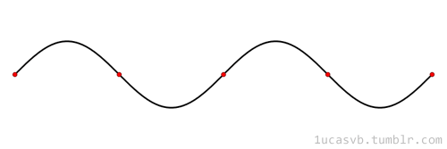

[↩️ صفحه اصلی](/README.md)

# 📐 ریاضی مهندسی

## 📊 اطلاعات کلی درس

    <table border="1">
        <thead>
            <tr>
                <th>کد درس</th>
                <th>واحد</th>
                <th>نوع درس</th>
                <th>پیش‌نیاز</th>
            </tr>
        </thead>
        <tbody>
            <tr>
                <td>492202</td>
                <td>3</td>
                <th>پایه</th>
                <td>معادلات دیفرانسیل، ریاضی 2</td>
            </tr>
        </tbody>
    </table>

## 🎯 اهداف درس
درس **ریاضی مهندسی** به بررسی مباحث پیشرفته در ریاضیات می‌پردازد که در حل مسائل مهندسی و علمی کاربرد دارد. این درس شامل تحلیل و حل معادلات دیفرانسیل، معادلات موج و گرما، آنالیز مختلط و کاربردهای آن‌ها است.

## 📚 منابع درس
---
[جزوه های کلاس دکتر یاراحمدی](./جزوه%20ها/جزوه%20ها.rar)

## 📅 سیلابس درس

این سیلابس بر اساس تدریس **دکتر یاراحمدی** از گروه ریاضی ارائه می‌شود:

    <table border="1">
        <thead>
            <tr>
                <th>موضوع</th>
            </tr>
        </thead>
        <tbody>
            <tr>
                <td>معادله موج</td>
            </tr>
            <tr>
                <td>معادله موج متناهی</td>
            </tr>
            <tr>
                <td>معادله موج نامتناهی</td>
            </tr>
            <tr>
                <td>روش دالامبر برای حل معادله موج نامتناهی</td>
            </tr>
            <tr>
                <td>معادله موج ناهمگن</td>
            </tr>
            <tr>
                <td>معادله گرما</td>
            </tr>
            <tr>
                <td>معادله گرما متناهی</td>
            </tr>
            <tr>
                <td>معادله گرما نامتناهی، معادله گرما ناهمگن و معادله لاپلاس</td>
            </tr>
            <tr>
                <td>آنالیز مختلط</td>
            </tr>
            <tr>
                <td>آنالیز مختلط - اعداد مختلط</td>
            </tr>
            <tr>
                <td>توابع مختلط و حد و مشتق آن‌ها</td>
            </tr>
            <tr>
                <td>انتگرال توابع مختلط</td>
            </tr>
            <tr>
                <td>قضیه کوشی و فرمول انتگرال کوشی</td>
            </tr>
            <tr>
                <td>سری‌های مختلط و قضیه مانده‌ها</td>
            </tr>
            <tr>
                <td>حل تمرین مبحث آنالیز مختلط</td>
            </tr>
        </tbody>
    </table>

---
موفق باشید! 🚀
