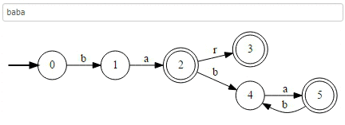

[↩️ صفحه اصلی](/README.md)

# 🖥️ نظریه زبان‌ها و ماشین‌ها

## 📊 اطلاعات کلی درس

| کد درس | واحد | نوع درس | پیش‌نیاز |
|:------:|:----:|:-------:|:--------:|
| 7777137 |  3   | اصلی   | ساختمان داده |

## 🎯 اهداف درس
در این درس، دانشجویان با مفاهیم اساسی نظریه زبان‌ها و ماشین‌ها آشنا می‌شوند. این شامل درک و تحلیل زبان‌های رسمی، گرامرها، و انواع مختلف ماشین‌های محاسباتی است.

## 📚 منابع درس
- **نظریه زبان‌ها و ماشین‌ها**
  - نویسنده: پیتر لینز
  - [دانلود](https://www.esfand.org/index.php/m2/17-cat17/169-cat169/808-%D8%AF%D8%A7%D9%86%D9%84%D9%88%D8%AF-%DA%A9%D8%AA%D8%A7%D8%A8-%D9%85%D9%82%D8%AF%D9%85%D9%87-%D8%A7%DB%8C-%D8%A8%D8%B1-%D9%86%D8%B8%D8%B1%DB%8C%D9%87-%D8%B2%D8%A8%D8%A7%D9%86%D9%87%D8%A7-%D9%88-%D9%85%D8%A7%D8%B4%DB%8C%D9%86-%D9%87%D8%A7-%E2%80%93-%D9%BE%DB%8C%D8%AA%D8%B1-%D9%84%DB%8C%D9%86%D8%B2-%D8%A8%D9%87-%D8%B2%D8%A8%D8%A7%D9%86-%D9%81%D8%A7%D8%B1%D8%B3%DB%8C)

## 👨‍🏫 مدرس
این درس در سال های اخیر توسط مهندس نجف‌پور ارائه می‌شود.(اسلاید های درس را می توانید از فرادرس دانلود کنید.)
[لینک](https://faradars.org/courses/fvsft110-theory-of-languages-and-machines) 

 

[دانلود اسلاید های دکتر فرخیان](https://raw.githubusercontent.com/CE-SCU/scu-computer-engineering-courses/main/%D9%86%DB%8C%D9%85%D8%B3%D8%A7%D9%84%204/%D9%86%D8%B8%D8%B1%DB%8C%D9%87%20%D8%B2%D8%A8%D8%A7%D9%86%20%D9%87%D8%A7%20%D9%88%20%D9%85%D8%A7%D8%B4%DB%8C%D9%86%20%D9%87%D8%A7/%D8%AC%D8%B2%D9%88%D9%87%20%D9%87%D8%A7/%D8%AF%DA%A9%D8%AA%D8%B1%20%D9%81%D8%B1%D8%AE%DB%8C%D8%A7%D9%86%2099-2/slides.zip)

[دانلود فصل به فصل اسلاید های دکتر فرخیان](./جزوه%20ها/دکتر%20فرخیان%2099-2/)

## 📅 سرفصل‌های درس

    <table border="1" style="text-align: right;">
        <thead>
            <tr>
                <th>موضوع</th>
            </tr>
        </thead>
        <tbody>
            <tr>
                <td>زبان منظم</td>
            </tr>
            <tr>
                <td>گرامر منظم</td>
            </tr>
            <tr>
                <td>اتوماتای متناهی (DFA, NFA)</td>
            </tr>
            <tr>
                <td>زبان و گرامر مستقل از متن</td>
            </tr>
            <tr>
                <td>ابهام - ساده سازی گرامر - فرم‌های نرمال</td>
            </tr>
            <tr>
                <td>اتوماتای پشته‌ای</td>
            </tr>
            <tr>
                <td>ماشین‌های تورینگ (TM)</td>
            </tr>
            <tr>
                <td>زبان‌های بازگشتی - گرامر بدون محدودیت و حساس به متن</td>
            </tr>
        </tbody>
    </table>

## 🔗 منابع مفید دیگر

- [دوره آموزشی نظریه زبان‌ها و ماشین‌ها در فرادرس](https://faradars.org/courses/fvsft110-theory-of-languages-and-machines) - این دوره می‌تواند منبع مفیدی برای یادگیری و تمرین بیشتر باشد.
- [Automata Theory - Stanford Lagunita](https://lagunita.stanford.edu/courses/course-v1:ComputerScience+Automata+SelfPaced/about) - دوره آنلاین رایگان از دانشگاه استنفورد
- [Theory of Computation - MIT OpenCourseWare](https://ocw.mit.edu/courses/18-404j-theory-of-computation-fall-2020/) - مواد درسی و ویدیوهای آموزشی از دانشگاه MIT
- [Formal Languages and Automata Theory - NPTEL](https://nptel.ac.in/courses/106/103/106103070/) - دوره آموزشی جامع از NPTEL (پروژه ملی آموزش فناوری پیشرفته هند)
- [GeeksforGeeks - Theory of Computation](https://www.geeksforgeeks.org/theory-of-computation-automata-tutorials/) - مجموعه‌ای از مقالات و آموزش‌های کاربردی

## 💡 نکات مهم
بارم‌بندی:

- بخش اعظم نمره مربوط به امتحانات است.
- در صورت وجود دستیار آموزشی (TA)، بخشی از نمره به حل تمرین اختصاص می‌یابد.

---

موفق باشید! 🎓