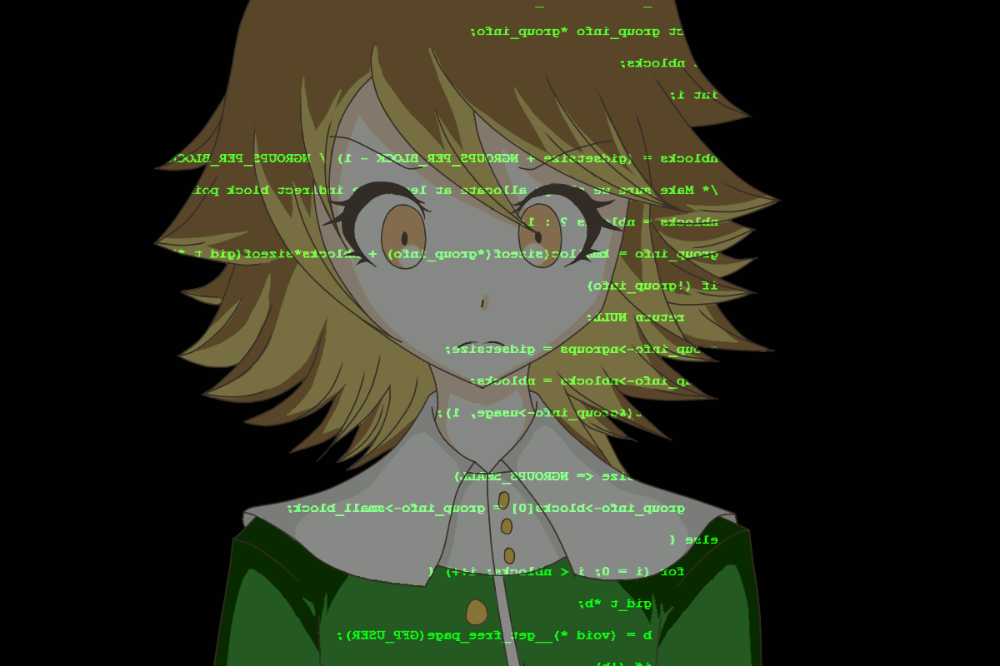

[↩️ صفحه اصلی](/README.md)
# 🖥️ اصول طراحی کامپایلر
منابع موجود در این صفحه توسط استاد نجف پور تدریس شده‌اند.

## 📊 اطلاعات کلی درس
| کد درس | واحد | نوع درس | پیش‌نیاز |
|:------:|:----:|:-------:|:--------:|
| 7777209 |  3   |  اصلی   |    [ساختمان داده](/نیمسال%203/ساختمان%20داده/README.md)    |

## 🎯 اهداف درس
هدف درس "طراحی کامپایلر" آشنایی با اصول و مفاهیم اساسی در طراحی و پیاده‌سازی کامپایلرها است. این درس دانشجویان را با مراحل مختلف پردازش یک برنامه، از تحلیل لغوی تا تولید کد نهایی، آشنا می‌کند و آن‌ها را برای توسعه کامپایلرهای کوچک و بهینه‌سازی آن‌ها آماده می‌سازد.

<!-- ## 📚 منابع اصلی درس
1. ** ** (th Edition)
   - نویسندگان: 
   - [لینک دانلود کتاب]() -->

<!-- ## 🛠️ نرم‌افزارهای مورد نیاز
-  -  -->

## 📅 سیلابس معمول

| موضوع| 
|:-----------:|
|مقدمه و معرفی کامپایلر|
|تحلیلگر لغوی|
|گرامرها|
|تجزیه بالا به پایین|
|تجزیه کننده پایین به بالا|
## 🔗 منابع مفید دیگر
- [آموزش طراحی کامپایلر فرادرس](https://faradars.org/courses/fvsft104-compiler-design)

<!-- ## 💡 نکات مهم -->

---
موفق باشید! 🚀