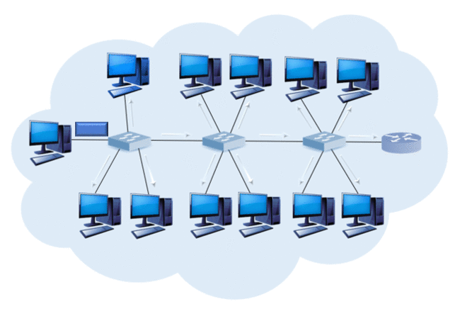

[↩️ صفحه اصلی](/README.md)

# 🌐 شبکه‌های کامپیوتری

## 📊 اطلاعات کلی درس
| کد درس | واحد | نوع درس | پیش‌نیاز |
|:------:|:----:|:-------:|:--------:|
| 7777144 |  3   |  اصلی   | سیستم‌های عامل |

## 🎯 اهداف درس
در این درس، دانشجویان با مفاهیم اساسی شبکه‌های کامپیوتری و ساختارهای شبکه‌ای آشنا خواهند شد. این درس شامل مباحثی مانند پروتکل‌های شبکه، لایه‌های OSI و اینترنت، روش‌های مسیریابی، امنیت شبکه و تکنولوژی‌های نوین در شبکه است.

## 📚 منابع درس
- **Computer Networking: A Top-Down Approach** (7th Edition)
  - نویسندگان: James Kurose و Keith Ross
    *(شبکه‌های کامپیوتری، رویکرد از فراز به فرود، ویراست ششم، ترجمه دکتر ملکیان)*
  - [لینک دانلود کتاب](https://www.ucg.ac.me/skladiste/blog_44233/objava_64433/fajlovi/Computer%20Networking%20_%20A%20Top%20Down%20Approach,%207th,%20converted.pdf)
  - [لینک دانلود اسلایدها](https://github.com/HanochShi/Supplements-ComputerNetworking-ATopDownApproach-7th-ed/tree/master/Powerpoint%20Slides)

### سایر منابع
- Tanenbaum, A. S., *Computer Networks*, 2020.  
  *(شبکه‌های کامپیوتری، ترجمه ملکیان، زارع‌پور، انتشارات نص)*
- Stallings, W., *Data and Computer Communications*, 8th edition, Prentice Hall, 2007.
- Leon-Garcia, A., *Communication Networks*, 2nd edition, McGraw-Hill, 2003.

## 🛠️ نرم‌افزارها
- [Wireshark](https://www.wireshark.org/) - ابزار تحلیل بسته‌های شبکه
---
- [Cisco Packet Tracer](https://www.netacad.com/courses/packet-tracer) - شبیه‌ساز شبکه
- [GNS3](https://www.gns3.com/) - شبیه‌ساز شبکه پیشرفته
- [Netcat](https://nc110.sourceforge.net/) - ابزار شبکه‌ای برای تست و عیب‌یابی

## 📅 سیلابس درس (برنامه تدریس دکتر نادران)

| هفته | موضوع |
|:----:|-------:|
|  1   | فصل 1: معرفی شبکه‌های کامپیوتری و شبکه اینترنت، تعریف شبکه‌های دسترسی |
|  2   | فصل 1: معرفی شبکه‌های کامپیوتری و شبکه اینترنت، تعریف شبکه‌های دسترسی |
|  3   | فصل 1: تعریف رسانه‌های فیزیکی، سوئیچینگ بسته و سوئیچینگ مداری |
|  4   | لایه کاربرد (مقدمات، تعریف سوکت، سرویس‌های اینترنت برای برنامه‌های کاربردی، HTTP) :فصل 2|
|  5   | HTTP پایا و ناپایا، کوکی‌ها، کشینگ، FTP، فصل 2: برنامه‌نویسی سوکت |
|  6   | فصل 3: میان ترم اول، لایه انتقال (مقدمات، سوکت، مالتی پلکس و دی مالتی پلکس) |
|  7   | ساختار سگمنت UDP و روش جمع تطبیقی، پروتکل‌های انتقال مطمئن، stop-&-wait، GBN، SR :فصل 3 |
|  8   | ساختار سگمنت TCP،فصل 3: شماره ترتیب‌ها، تخمین زمان تایمر |
|  9   | فصل 3: کنترل جریان و مدیریت اتصال، اصول کنترل ازدحام |
| 10   | میان­ترم دوم، لایه شبکه، صفحه­‌ی داده (مقدمات، مفهوم SDN، روش match+action) :فصل 4 |
| 11   | فصل 4: ساختمان داخلی مسیریاب، قطعه­ بندی |
| 12   | پروتکل IPv4، فصل 4: آدرس‌دهی|
| 13   | DHCP، NAT، ICMP :فصل 4 |
| 14   | لایه شبکه، صفحه­‌ی کنترل (الگوریتم‌های مسیریابی LSR و DVR) :فصل 5 |
| 15   | لایه پیوند داده: (مقدمات، تشخیص خطا: پریتی، CRC، پروتکل‌های دسترسی به کانال) :فصل 6 |
| 16   | ARP و آدرس‌های MAC، فصل 6: اترنت، سوئیچ |

## 🔗 منابع مفید دیگر

- [NetworkChuck YouTube Channel](https://www.youtube.com/user/NetworkChuck)
- [Fundamentals of Networking for Effective Backend Design](https://downloadly.ir/elearning/video-tutorials/fundamentals-of-networking-for-effective-backend-design/)
## 💡 نکات مهم
بارم‌بندی طبق طرح درس دکتر نادران به شرح زیر است:

| مورد | نمره |
|:----:|:----:|
| امتحان پایان‌ترم | 8 |
| امتحان میان‌ترم | 7 |
| تمرین‌ها | 2 |
| پروژه‌ها | 3 |

توجه: کسب حداقل 50% مجموع امتحانات میان ترم و پایان ترم برای قبولی در درس الزامی است. 

پروژه‌های برنامه‌نویسی در گروه‌های 1 یا 2 نفره تعریف و تحویل گرفته می‌شوند.

---

 موفق باشید! 🚀

