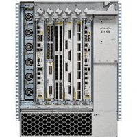

[↩️ صفحه اصلی](/README.md)

# 🌐 آزمایشگاه شبکه‌های کامپیوتری

## 📊 اطلاعات کلی درس

| کد درس | واحد | نوع درس | هم‌نیاز |
|:------:|:----:|:-------:|:-------:|
| 7777146 |  1   | عملی   | شبکه‌های کامپیوتری |

   

**این درس در سال های اخیر توسط مهندس مهرداد سرکهکی تدریس شده است.**

## 🎯 اهداف درس

هدف از این درس آشنایی عملی دانشجویان با مفاهیم شبکه‌های کامپیوتری، پیاده‌سازی و شبیه‌سازی شبکه‌ها، و کسب مهارت‌های عملی در زمینه طراحی و عیب‌یابی شبکه است. در طول این درس، دانشجویان با مواردی چون موارد زیر آشنا می‌شوند:

1. **آشنایی با محیط Cisco Packet Tracer**: 
   دانشجویان یاد می‌گیرند چگونه از این نرم‌افزار قدرتمند برای شبیه‌سازی شبکه‌های کامپیوتری استفاده کنند. این شامل آشنایی با رابط کاربری، ابزارها و امکانات نرم‌افزار می‌شود.

2. **ایجاد و پیکربندی شبکه‌های ساده**: 
   دانشجویان شروع به ساخت شبکه‌های ساده می‌کنند و یاد می‌گیرند چگونه دستگاه‌های مختلف را به هم متصل کرده و پیکربندی اولیه را انجام دهند.

3. **پروتکل‌های مسیریابی مانند RIP**: 
   آشنایی با پروتکل‌های مسیریابی از جمله RIP (Routing Information Protocol) و نحوه پیکربندی آن‌ها در روترها. دانشجویان یاد می‌گیرند چگونه این پروتکل‌ها به تبادل اطلاعات مسیریابی بین روترها کمک می‌کنند.

4. **پیکربندی DHCP و DNS**: 
   دانشجویان با نحوه راه‌اندازی و پیکربندی سرویس‌های DHCP (Dynamic Host Configuration Protocol) برای تخصیص خودکار آدرس IP و DNS (Domain Name System) برای ترجمه نام‌های دامنه به آدرس‌های IP آشنا می‌شوند.

...

## 🖥️ نرم‌افزار مورد استفاده
- **Cisco Packet Tracer**
  - این نرم‌افزار یک ابزار قدرتمند برای شبیه‌سازی شبکه است که توسط شرکت سیسکو ارائه شده است.
  - دانشجویان با استفاده از این نرم‌افزار می‌توانند انواع توپولوژی‌های شبکه را طراحی، پیکربندی و عیب‌یابی کنند.
  - [دانلود](https://www.yasdl.com/102884/%D8%AF%D8%A7%D9%86%D9%84%D9%88%D8%AF-cisco-packet-tracer.html)

## 🔗 منابع مفید

- [Cisco Networking Academy](https://www.netacad.com/) - دوره‌های رسمی سیسکو برای یادگیری شبکه
- [Packet Tracer Network Simulation Examples](https://www.packettracernetwork.com/) - مجموعه‌ای از مثال‌های شبیه‌سازی شده
- [GNS3 Academy](https://academy.gns3.com/) - منابع آموزشی برای شبیه‌سازی شبکه (علاوه بر Packet Tracer)

---

موفق باشید! 🌟

