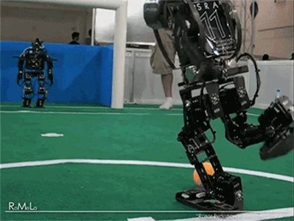

[↩️ صفحه اصلی](/README.md)

# 🤖 اصول رباتیک

## 📊 اطلاعات کلی درس
| کد درس | واحد | نوع درس | پیش‌نیاز |
|:------:|:----:|:-------:|:--------:|
| 7777233 |  3   | تخصصی   | سیگنال‌ها و سیستم‌ها |

## 🎯 اهداف درس
در این درس، شما با جنبه‌های مختلف رباتیک از جمله نحوه حس‌گری و اندازه‌گیری، برنامه‌ریزی حرکت و طراحی سیستم‌های رباتیک آشنا خواهید شد. هدف این است که دانشجویان قادر به درک و پیاده‌سازی سیستم‌های رباتیک باشند.

## 📚 منابع درس
- **Introduction to Autonomous Mobile Robots**
  - گردآورندگان: Roland Siegwart و Illah R. Nourbakhsh
  - [لینک دانلود کتاب و اسلایدها](https://github.com/CE-SCU/scu-computer-engineering-courses/tree/main/%D9%86%DB%8C%D9%85%D8%B3%D8%A7%D9%84%208/%D8%A7%D8%B5%D9%88%D9%84%20%D8%B1%D8%A8%D8%A7%D8%AA%DB%8C%DA%A9%D8%B2/%D9%85%D9%86%D8%A7%D8%A8%D8%B9/%D9%85%D9%86%D8%A7%D8%A8%D8%B9%20%D8%AF%DA%A9%D8%AA%D8%B1%20%D8%A7%D9%81%D8%B4%D9%86%20%D9%82%D9%86%D8%A8%D8%B1%20%D8%B2%D8%A7%D8%AF%D9%87)

## 🛠️ نرم‌افزارها
[Webots](https://www.cyberbotics.com/) - شبیه‌ساز رباتیک برای برنامه‌ریزی و مدل‌سازی ربات‌ها

## 📅 سیلابس درس

    <table border="1" style="text-align: right;">
        <thead>
            <tr>
                <th>موضوع</th>
            </tr>
        </thead>
        <tbody>
            <tr>
                <td>Introduction</td>
            </tr>
            <tr>
                <td>Mobile Robot</td>
            </tr>
            <tr>
                <td>Robot Sensing and Sensors</td>
            </tr>
            <tr>
                <td>Robot Motion Planning</td>
            </tr>
        </tbody>
    </table>

## 🔗 منابع مفید دیگر

- [Kajal Gada YouTube Channel](https://www.youtube.com/@KajalGada) - پروژه های مختلف 
- [Robotics Stack Exchange](https://robotics.stackexchange.com/) - پرسش و پاسخ درباره رباتیک

## 💡 نکات مهم

بارم بندی:
| مورد | نمره |
|:----:|:----:|
| امتحان پایان‌ترم | 15 |
| پروژه‌ | 5 |

توجه: این بارم بندی مطابق طرح درس دکتر افشین قنبر زاده از گروه مکانیک در ترم 14022 می باشد.

---

موفق باشید! 🚀
