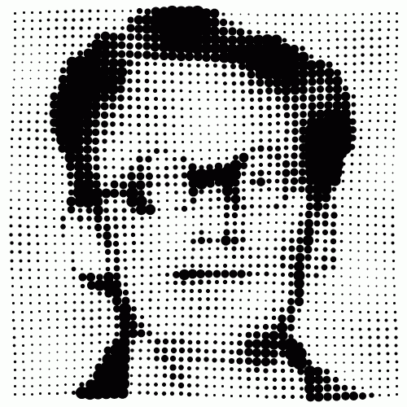

[↩️ صفحه اصلی](/README.md)

# 🖼️ مبانی بینایی کامپیوتر

## 📊 اطلاعات کلی درس

| کد درس | واحد | نوع درس | پیش‌نیاز |
|:------:|:----:|:-------:|:--------:|
| 7777231 |  3   | تخصصی  | مبانی هوش محاسباتی |

## 🎯 اهداف درس
در این درس، دانشجویان با مفاهیم اساسی و تکنیک‌های پایه‌ای در زمینه بینایی کامپیوتر و پردازش تصویر آشنا می‌شوند.

## 📚 منابع درس
- **[Digital Image Processing, 3rd Edition](./منابع/)**
  - نویسندگان: Rafael C. Gonzalez و Richard E. Woods
  - فصل‌های مورد مطالعه: 1، 2، 3 

## 📅 سیلابس درس

    <table border="1" style="text-align: right;">
        <thead>
            <tr>
                <th>موضوع</th>
            </tr>
        </thead>
        <tbody>
            <tr>
                <td>مقدمه (Introduction)</td>
            </tr>
            <tr>
                <td>مبانی تصویر دیجیتال (Digital image fundaments)</td>
            </tr>
            <tr>
                <td>تبدیل‌های شدت (Intensity transformation)</td>
            </tr>
            <tr>
                <td>پردازش تصویر مورفولوژیکی (Morphological image processing)</td>
            </tr>
        </tbody>
    </table>

## 💡 توضیحات اضافی

- این درس در نیمسال دوم 1402 توسط دکتر علوی تدریس شده است.
- اطلاعات ارائه شده بر اساس ترم مذکور است و ممکن است در سال‌های آینده تغییراتی در استاد درس یا سرفصل‌ها ایجاد شود.

## 📝 تمرین‌ها

در این ترم، دانشجویان تمرین‌هایی با موضوعات زیر داشتند:

1. تحقیق درباره یکی از فرمت‌های تصویر
2. یادگیری و پیاده‌سازی تبدیل فرمت تصاویر بدون استفاده از کتابخانه‌های آماده

## 📊 بارم‌بندی

برخلاف سایر درس‌هایی که دکتر علوی تدریس کرده‌اند، بارم‌بندی این درس به شکل زیر بوده است:

- امتحان پایان ترم: 8 نمره
- فعالیت‌های کلاسی: بخش بیشتر نمره

## 📚 منابع اضافی و مفید

علاوه بر کتاب اصلی درس، منابع زیر می‌توانند برای یادگیری بهتر و عمیق‌تر مفاهیم بینایی کامپیوتر مفید باشند:

### کتاب‌ها:
1. "Computer Vision: Algorithms and Applications" by Richard Szeliski
2. "Computer Vision: Models, Learning, and Inference" by Simon J.D. Prince

### دوره‌های آنلاین:
1. [CS231n: Convolutional Neural Networks for Visual Recognition](http://cs231n.stanford.edu/) - Stanford University
2. [Introduction to Computer Vision](https://www.udacity.com/course/introduction-to-computer-vision--ud810) - Udacity

### وبسایت‌ها و منابع آنلاین:
1. [OpenCV Documentation](https://docs.opencv.org/) - مستندات کتابخانه OpenCV
2. [PyImageSearch](https://www.pyimagesearch.com/) - آموزش‌ها و مقالات کاربردی در زمینه بینایی کامپیوتر
3. [Digital Image Processing Basics geeksforgeeks](https://www.geeksforgeeks.org/digital-image-processing-basics/)
### مجله‌های علمی:
1. IEEE Transactions on Pattern Analysis and Machine Intelligence
2. International Journal of Computer Vision

---

موفق باشید! 🚀